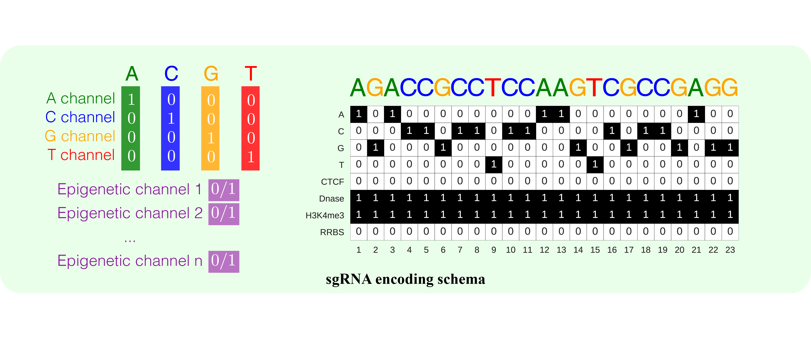

# DeepCRISPR
[](https://zenodo.org/badge/latestdoi/117238113)

## Introduction
DeepCRISPR is a deep learning based prediction model for sgRNA on-target knockout
 efficacy and genome-wide off-target cleavage profile prediction. 
 
 This model is based on a carefully designed hybrid deep neural network for model training and prediction.

Current version focuses on conventional NGG-based sgRNA design for SpCas9 in human species, for it is
 widely used in related experiments.
 
Online version of [DeepCRISPR](http://www.deepcrispr.net/) is also maintained.
 
## Requirement
* python == 3.6
* tensorflow == 1.3.0
* sonnet == 1.9

## Docker image
```bash
docker pull michaelchuai/deepcrispr:1.0
```
Note:
1. Using the command above to attain DeepCRISPR image;
2. The path of DeepCRISPR program and trained models in the image is `/root/DeepCRISPR`.

## Usage
1. Digitalize sgRNA using the following **sgRNA Coding Schema**. Epigenetics features can be found in [ENCODE](https://www.encodeproject.org/).
2. Load models from model directories (untar them first!) in `trained_models`. 
3. Perform prediction.



### On-target prediction
#### Digitalization
Choose 4 channels for sequence-only prediction or 8 channels for full-featured prediction, according to the sgRNA Coding Schema above.

```python
import tensorflow as tf
from deepcrispr import DCModelOntar

seq_feature_only = False
channels = 4 if seq_feature_only else 8
x_on_target = ...     # [batch_size, channels, 1, 23]
```

#### Loading Model

```python
sess = tf.InteractiveSession()
on_target_model_dir = '<model path>'
# using regression model, otherwise classification model
is_reg = True
# using sequences feature only, otherwise sequences feature + selected epigenetic features
seq_feature_only = False
dcmodel = DCModelOntar(sess, on_target_model_dir, is_reg, seq_feature_only)
```

Model file name | Description
-----------|------------
ontar_ptaug_cnn.tar.gz | CNN-based on-target classification model with pre-training and data augmentation
ontar_pt_cnn_reg.tar.gz | CNN-based on-target regression model with pre-training and data augmentation
ontar_cnn_reg_seq.tar.gz | Sequence feature-only CNN-based on-target regression model with data augmentation

#### Prediction

```python
predicted_on_target = dcmodel.ontar_predict(x_on_target)
```


### Off-target prediction
#### Digitalization
Off-target prediction supports full-featured prediction only.

```python
import tensorflow as tf
from deepcrispr import DCModelOfftar

channels = 8
x_on_target = ...       # [batch_size, channels, 1, 23]
x_sg_off_target = ...   # [batch_size, channels, 1, 23]
x_ot_off_target = ...   # [batch_size, channels, 1, 23]
```

#### Loading Model

```python
sess = tf.InteractiveSession()
off_target_model_dir = '<model path>'
# using regression model, otherwise classification model
is_reg = True
dcmodel = DCModelOfftar(sess, off_target_model_dir, is_reg)
```

Model file name | Description
-----------|------------
offtar_pt_cnn.tar.gz | CNN-based off-target classification model with pre-training
ontar_pt_cnn_reg.tar.gz | CNN-based off-target regression model with pre-training

#### Prediction

```python
predicted_off_target = dcmodel.offtar_predict(x_sg_off_target, x_ot_off_target)
```


## Citation
Guohui Chuai, Qi Liu et al. *DeepCRISPR: optimized CRISPR guide RNA design by deep learning. 2018* (**Manuscript submitted**)

## Contacts
18alexanderm117@tongji.edu.cn or qiliu@tongji.edu.cn
